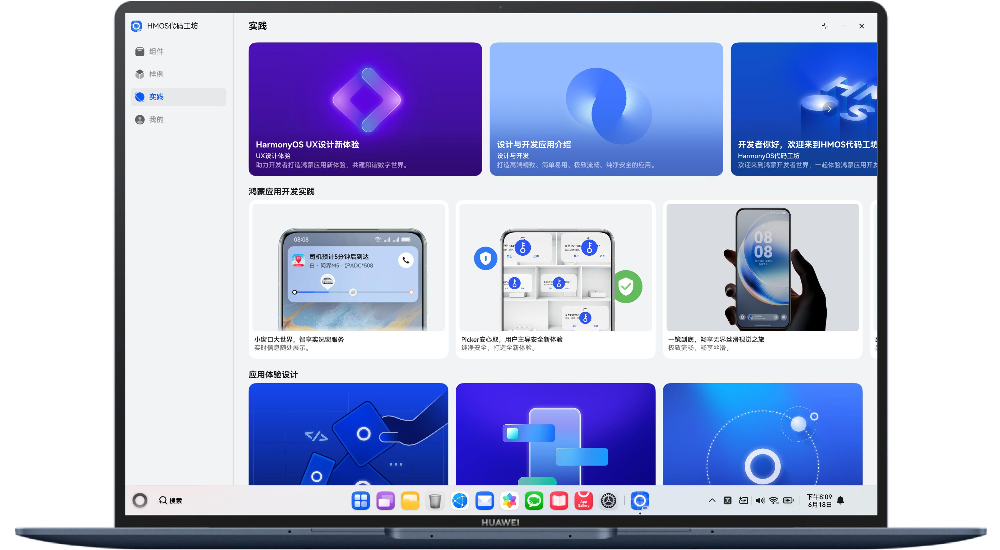

# HarmonyOS代码工坊
## 一、「HarmonyOS代码工坊」APP尝鲜上线了！
为了帮助广大开发者更高效的完成鸿蒙应用开发，华为官方重磅打造了一款名为「HarmonyOS代码工坊」的开源APP。「HarmonyOS代码工坊」汇聚华为官方优质代码案例，覆盖多场景开发需求，通过标准化、模块化的代码实践，帮助开发者快速掌握鸿蒙应用开发技巧，加速项目落地进程，开启鸿蒙开发新征程！

【应用开发最佳实践】 

「HarmonyOS代码工坊」承载鸿蒙应用架构最佳实践，支持1+8设备运行，全方位体现鸿蒙应用的精致、流畅、智能、易用、安全、全场景互联等特点，并持续迭代鸿蒙新特性。

【示例代码一键获取】 

其中内置集成华为官方优质Samples示例代码，覆盖高频的鸿蒙应用开发场景，并支持源码的一键分享，给开发者提供所见即所得的样例代码，支撑开发者高效完成鸿蒙应用的开发。

【应用市场下载】 
- 下载地址：https://appgallery.huawei.com/app/detail?id=com.huawei.hmos.world&channelId=SHARE 

【代码开源地址】
- 「HarmonyOS代码工坊」源码地址：https://gitee.com/harmonyos_samples/sample_in_harmonyos
- 示例代码汇总地址：https://gitee.com/harmonyos_samples

【效果图】


@联系我们 

「HarmonyOS代码工坊」相关开发案例正在陆续更新中，您还期待我们为您提供什么样的开发案例，或还有什么宝贵意见，欢迎联系我们，非常期待您的反馈和建议，以促进我们不断改进！
- 官方邮箱：hmosworld@huawei.com
- 意见反馈：https://www.wjx.cn/vm/rXBoIC0.aspx

## 二、功能介绍（手机、折叠屏、平板、PC/2in1）
### 组件库首页
组件首页作为APP的入口页面，负责展示组件卡片，给用户提供不同组件的展示入口。主要包括页签区和内容区，内容区包括banner海报位与卡片入口。

| 手机                     | 平板                              | PC/2in1                               |
|------------------------|---------------------------------------|---------------------------------------|
|  |  |  |

### 组件库详情页
组件详情页承载全套符合HarmonyOS设计规范的ArkUI组件和开箱即用的特性能力。页面包括预览区、属性调整区、代码区和推荐列表四块，手动调整属性，可以看到预览区与代码区会发生相应的变化。

| 手机                                     | 平板                               | PC/2in1                                |
|----------------------------------------|----------------------------------------|----------------------------------------|
|  |  |  |
### 样例页
样例页面主要由banner海报位与Samples卡片入口组成，入口位包含四个tab页签：2025 HDC、多设备开发、ArkUI实践、功能开发。点击不同页签展示不同类别的Sample案例。

| 手机                                    | 平板                              | PC/2in1                               |
|---------------------------------------|---------------------------------------|---------------------------------------|
|  |  |  |
### 实践
实践页面主要由banner海报位与最佳实践文章卡片入口组成。文章围绕“如何构建一个鸿蒙大型应用”，将「HarmonyOS代码工坊」设计、开发到上架整个开发者旅程以最佳实践文章的形式进行内容输出。

| 手机                                    | 平板                              | PC/2in1                               |
|---------------------------------------|---------------------------------------|---------------------------------------|
|  |  |  |
## 三、功能介绍（华为智能穿戴设备）
### 样例页
「HarmonyOS代码工坊」在样例模块已集成四个案例：包括音乐播放、视频播放、地图导航和骑行导航等。

| 首页                                     | 样例页                                    | 音乐播放案例页                                |
|----------------------------------------|----------------------------------------|----------------------------------------|
|  |  |  |
## 四、工程结构
```
├──common/src/main/ets                                  // 公共模块
│  ├──component                                         // 公共组件库
│  ├──constant                                          // 公共常量文件
│  ├──model                                             // 公共数据类
│  ├──routermanager                                     // 路由管理类
│  ├──storagemanager                                    // 存储模块
│  ├──updateservice                                     // 包更新模块
│  ├──util                                              // 工具类
│  ├──view                                              // 公共页面库
│  └──viewmodel                                         // ViewModel父类
├──features                                             // feature层
│  ├──commonbusiness                                    // feature公共模块
│  ├──componentlibrary                                  // 组件模块业务
│  ├──devpractices                                      // 样例模块
│  ├──exploration                                       // 实践模块
│  └──mine                                              // 我的模块
├──products                                             // 产品定制层
│  ├──phone                                             // 手机设备入口
│  └──wearable                                          // 华为智能穿戴设备入口
└──hmosword-build                                       // Sample下载脚本
```

## 五、代码运行
「HarmonyOS代码工坊」APP集成了大量Sample，开发者可以选择：
1. 直接运行「HarmonyOS代码工坊」本体代码，体验组件与实践功能，样例模块Sample无法进入。
2. 运行脚本下载Sample代码，体验全量「HarmonyOS代码工坊」功能。

### 1、直接运行「HarmonyOS代码工坊」

#### 手机、折叠屏、平板、PC/2in1设备运行
1. DevEco studio打开工程文件，等待Sync完成。
2. 点击运行入口配置，选中phone。

3. 连接设备，点击签名文件入口进行签名，按照图示进行勾选，最后点击ok完成签名。

4. 点击运行，等待编译完成。


#### 华为智能穿戴设备运行
1. DevEco studio打开工程文件，等待Sync完成。
2. 点击运行入口配置，选中wearable。

3. 连接设备，点击签名文件入口进行签名，最后点击ok完成签名。
4. 点击运行，等待编译完成。


### 2、集成Sample后，运行「HarmonyOS代码工坊」

#### Sample下载
1. 确保电脑中已成功安装git，打开DevEco studio终端（Terminal）。
2. 执行`cd hmosword-build`进入到[hmosword-build](hmosword-build)目录。

3. 再执行`npm i`下载依赖包。如果出现以下错误，请在终端执行`npm config set registry https://registry.npmjs.org/` 设置官方镜像源。


4. 依赖包下載成功后，执行 `node .\index.js`运行脚本。此步骤会全量下载工程依赖的sample，并且更新「HarmonyOS代码工坊」的[build-profile.json5](build-profile.json5)配置文件。下載过程中会由于网络情况出现部分sample下载失败，可以在当前任务结束后重复执行`node .\index.js`。
5. 确保sample成功下载后，点击DevEco studio的File->Sync and refresh Project重新编译。

#### 手机、折叠屏、平板、PC/2in1设备集成sample运行
以下sample支持手机、折叠屏、平板、PC/2in1：
animationcollectionsample、audiointeractionsample、componentstacksample、customdialogsample、dragframeworksample、fluentblogsample、gridhybridsample、imagecommentsample、keyboardsample、listexchangesample、listitemeditsample、locationservicesample、multibusinesssample、multicolumnssample、multiconvinientlifesample、multimobilepaymentsample 、multinavbarsample、multinewsreadsample、multipleimagesample、multitabnavigationsample、multitravelsample、nestedslidingsample、pageredirectionsample、pickersample、preferencessample、texteffectssample、transitionscollectionsample、verificationcodescenariosample、waterflowsample、webprerendersample、windowpipsample、continuepublishsample、liveviewlockscreensample、videocastsample、knocksharesample。
1. 修改运行入口，选中phone点击`Deploy Multi Hap`勾选支持手机、折叠屏、平板、PC/2in1的hap，注意不要勾选其余hap包（smartwatchshortvideosample、smartwatchmapsample、smartwatchcarcontrolsample、wearable、wearablemusicsample）。

2. 成功勾选后点击OK完成配置修改。
3. 点击运行，等待编译完成。

#### 华为智能穿戴设备集成sample运行
以下sample支持华为智能穿戴设备：smartwatchshortvideosample、smartwatchmapsample、smartwatchcarcontrolsample、wearablemusicsample。
1. 修改运行入口，选中wearable后，点击`Deploy Multi Hap`勾选支持华为智能穿戴设备的hap，注意不要勾选其余hap包。

2. 成功勾选后点击OK完成配置修改。
3. 点击运行，等待编译完成。

## 六、约束与限制
1. 本示例仅支持标准系统上运行，支持多种设备：华为智能穿戴设备、手机、折叠屏、平板、PC/2in1等。
2. HarmonyOS系统：HarmonyOS 5.1.0 Release及以上。
3. DevEco Studio版本：DevEco Studio 5.1.0 Release及以上。
4. HarmonyOS SDK版本：HarmonyOS 5.1.0 Release SDK及以上。

## 七、版本更新说明
【鸿蒙新特性】本次公测新增6个创新案例，欢迎体验： 

- 「HarmonyOS代码工坊」本体（支持华为穿戴设备、手机、折叠屏、平板、PC/2in1）。
- MateXT适配案例：备忘录&日历。
- PuraX适配案例：内外屏沉浸式扩感导航。
- 碰一碰视频快速分享。
- 多设备视频投播。
- 跨设备内容编辑（分布式照相机、键鼠穿越）。 

以上代码全部开源，欢迎下载体验！